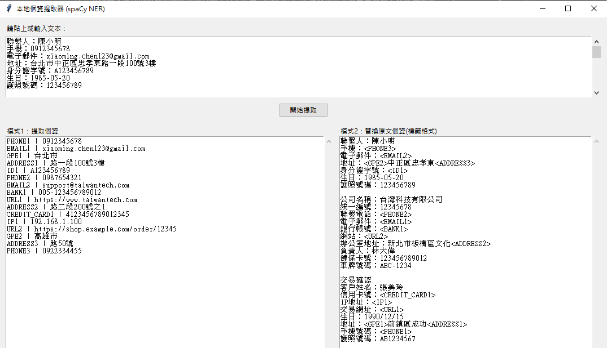
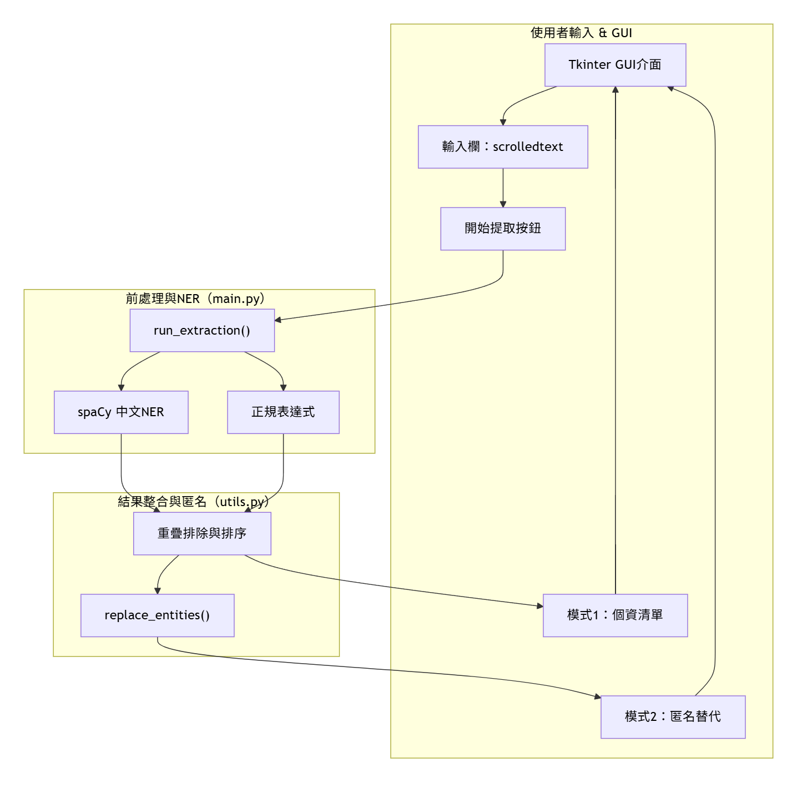
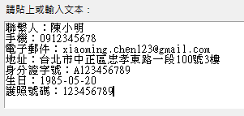
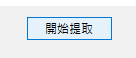

# Local_PII_Extractor

支援中文處理的本地個資提取與替換工具，使用 spaCy NER + 正規表示式完成雙重偵測，並提供簡潔 GUI 操作介面。  
A local PII (Personally Identifiable Information) extraction and replacement tool supporting Chinese, utilizing spaCy NER and regular expressions for dual detection, with a user-friendly GUI interface.

## 🖼️ 使用介面 / User Interface

主介面簡潔直觀，適合資料匿名化前處理。  
The main interface is clean and intuitive, ideal for cybersecurity research, development testing, and data anonymization preprocessing.


---

## 專案動機 / Project Motivation

許多使用者習慣將資料輸入至如 GPT, Grok或Claude等AI模型進行處理，但這些資料可能包含機敏資訊（例如電話號碼、身分證號、信用卡資訊等），直接上傳可能面臨個資外洩的風險。

那我就想到，如果能在上傳資料到這些大語言模型之前，先在本地**自動**把重要資料先移除 (手動的話會很久很麻煩)，避免資料偷偷被這些公司拿去蒐集訓練，造成個資外洩，所以就結合自己在自然語言處理領域的研究，使用NER的方式去實作。

開發 **Local PII Extractor**，支援中文的本地個資提取與匿名化工具，使用spaCy與正規表示式進行雙重偵測，並提供簡潔的 GUI 操作介面，讓使用者能夠在本地環境中安全地處理敏感資料。

Many users nowadays rely on AI models like GPT, Grok, or Claude to process their data. However, this data often contains sensitive information—such as phone numbers, national IDs, or credit card numbers—which, if uploaded directly, poses serious privacy risks.

That got me thinking: what if we could automatically remove or anonymize sensitive data before uploading it to these large language models? Manually doing so is tedious and time-consuming. To solve this, I applied my knowledge in natural language processing (NLP) and used Named Entity Recognition (NER) techniques to build a solution.

I developed Local PII Extractor, a privacy-focused tool that runs entirely offline and supports Chinese. It combines spaCy and regular expressions for dual-layer detection of personally identifiable information (PII), and provides a simple graphical interface for secure, local data processing.
## 架構


## 功能說明 / Features

- 使用 `spaCy` 搭配 `zh_core_web_sm` 模型進行中文命名實體識別（NER）  
  Utilizes spaCy’s `zh_core_web_sm` model for Chinese Named Entity Recognition (NER).
- 自訂正則表達式強化偵測電話、信箱、身分證、信用卡等個資  
  Custom regular expressions enhance detection of phone numbers, emails, ID numbers, credit cards, etc.
- 提供兩種輸出模式：  
  Provides two output modes:
  - 模式一：列出所有偵測到的個資  
    Mode 1: Lists all detected PII.
  - 模式二：替換原文中的個資為標籤（如 `<PHONE1>`）  
    Mode 2: Replaces PII in the original text with tagged placeholders (e.g., `<PHONE1>`).
- 完全本地執行，無需上傳任何資料，保障隱私  
  Fully local execution, requiring no data uploads, ensuring privacy.


## 🧪 安裝與執行 / Installation and Execution

### 1. 安裝相依套件 / Install Dependencies

```bash
pip install -r requirements.txt
```

### 2. 執行主程式 / Run the Program

```bash
python main.py
```

### 3. 在上方輸入框貼上原始文章 / Paste the Original Text in the Top Input Box



### 4. 按下轉換 / Click Convert



### 5. 左右為相互對應的資料 / Left and Right Outputs Correspond to Each Other


第一次執行會自動下載 spaCy 的中文模型。  
The first run will automatically download spaCy’s Chinese model.

## 📁 專案結構 / Project Structure

```
Local_PII_Extractor/
├── main.py              # 主程式與 GUI 介面 / Main program with GUI interface
├── utils.py             # 工具函式（正規表達式、替換、匯出） / Utility functions (regex, replacement, export)
├── requirements.txt     # 相依套件清單 / List of dependencies
└── README.md            # 說明文件 / Documentation
```

## 🧠 支援偵測類別 / Supported Detection Categories

- 電話號碼（PHONE） / Phone Number
- 電子郵件（EMAIL） / Email
- 身分證號（ID） / ID Number
- 銀行帳號（BANK） / Bank Account
- IP 位址（IP） / IP Address
- 網址（URL） / URL
- 信用卡號（CREDIT_CARD） / Credit Card
- 地址（ADDRESS） / Address
- 其他來自 spaCy 的 LOC、DATE、GPE、MONEY 等 / Other spaCy categories: LOC, DATE, GPE, MONEY, etc.

## 📌 聯絡我 / Contact Me

如有功能建議或合作需求，歡迎聯絡：  
For feature suggestions or collaboration inquiries, feel free to contact:

- GitHub: [chewu-0319](https://github.com/chewu-0319)
- Email: dylan.jc2222@gmail.com
- Website: [https://chewu.tw](https://chewu.tw)
