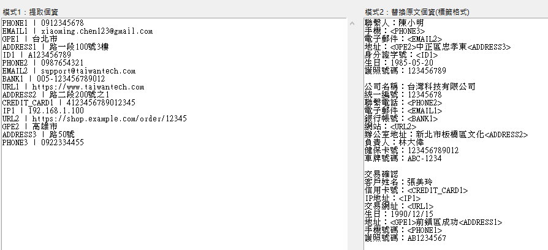

# Local_PII_Extractor

支援中文處理的本地個資提取與替換工具，使用 spaCy + 正規表示式完成雙重偵測，並提供簡潔 GUI 操作介面。  
A local PII (Personally Identifiable Information) extraction and replacement tool supporting Chinese, utilizing spaCy and regular expressions for dual detection, with a user-friendly GUI interface.

## 專案動機 / Project Motivation

隨著 AI 技術的快速發展，許多人習慣將資料直接輸入至如 GPT、Grok 或 Claude 等雲端 AI 模型進行處理。然而，這些資料可能包含機敏資訊（例如電話號碼、身分證號、信用卡資訊等），直接上傳可能面臨個資外洩的風險，特別是當這些資料被用於模型訓練時，可能引發嚴重的資安危機。為了解決這一問題，**Local_PII_Extractor** 應運而生。本專案旨在提供一個完全本地的個資提取與匿名化工具，無需上傳任何資料至雲端，確保用戶資料的安全性，特別適合需要進行資料匿名化前處理的資安研究、開發測試或敏感資料處理場景。  
With the rapid rise of AI technologies, many users input data into cloud-based AI models like GPT, Grok, or Claude for processing. However, such data may contain sensitive information (e.g., phone numbers, ID numbers, credit card details), and uploading it could pose risks of data leakage, especially if used for model training, potentially leading to serious security issues. To address this, **Local_PII_Extractor** was developed. This project provides a fully local PII extraction and anonymization tool, requiring no data uploads to the cloud, ensuring user data security. It is ideal for cybersecurity research, development testing, or scenarios requiring data anonymization preprocessing.

## 功能說明 / Features

- 使用 `spaCy` 搭配 `zh_core_web_sm` 模型進行中文命名實體識別（NER）  
  Utilizes spaCy’s `zh_core_web_sm` model for Chinese Named Entity Recognition (NER).
- 自訂正則表達式強化偵測電話、信箱、身分證、信用卡等個資  
  Custom regular expressions enhance detection of phone numbers, emails, ID numbers, credit cards, etc.
- 提供兩種輸出模式：  
  Provides two output modes:
  - 模式一：列出所有偵測到的個資  
    Mode 1: Lists all detected PII.
  - 模式二：替換原文中的個資為標籤（如 `<PHONE1>`）  
    Mode 2: Replaces PII in the original text with tagged placeholders (e.g., `<PHONE1>`).
- 完全本地執行，無需上傳任何資料，保障隱私  
  Fully local execution, requiring no data uploads, ensuring privacy.

## 🖼️ 使用介面 / User Interface

主介面簡潔直觀，適合資安研究、開發測試、資料匿名化前處理。  
The main interface is clean and intuitive, ideal for cybersecurity research, development testing, and data anonymization preprocessing.


## 🧪 安裝與執行 / Installation and Execution

### 1. 安裝相依套件 / Install Dependencies

```bash
pip install -r requirements.txt
```

### 2. 執行主程式 / Run the Program

```bash
python main.py
```

### 3. 在上方輸入框貼上原始文章 / Paste the Original Text in the Top Input Box


### 4. 按下轉換 / Click Convert


### 5. 左右為相互對應的資料 / Left and Right Outputs Correspond to Each Other



第一次執行會自動下載 spaCy 的中文模型。  
The first run will automatically download spaCy’s Chinese model.

## 📁 專案結構 / Project Structure

```
Local_PII_Extractor/
├── main.py              # 主程式與 GUI 介面 / Main program with GUI interface
├── utils.py             # 工具函式（正規表達式、替換、匯出） / Utility functions (regex, replacement, export)
├── requirements.txt     # 相依套件清單 / List of dependencies
└── README.md            # 說明文件 / Documentation
```

## 🧠 支援偵測類別 / Supported Detection Categories

- 電話號碼（PHONE） / Phone Number
- 電子郵件（EMAIL） / Email
- 身分證號（ID） / ID Number
- 銀行帳號（BANK） / Bank Account
- IP 位址（IP） / IP Address
- 網址（URL） / URL
- 信用卡號（CREDIT_CARD） / Credit Card
- 地址（ADDRESS） / Address
- 其他來自 spaCy 的 LOC、DATE、GPE、MONEY 等 / Other spaCy categories: LOC, DATE, GPE, MONEY, etc.

## 📌 聯絡我 / Contact Me

如有功能建議或合作需求，歡迎聯絡：  
For feature suggestions or collaboration inquiries, feel free to contact:

- GitHub: [chewu-0319](https://github.com/chewu-0319)
- Email: dylan.jc2222@gmail.com
